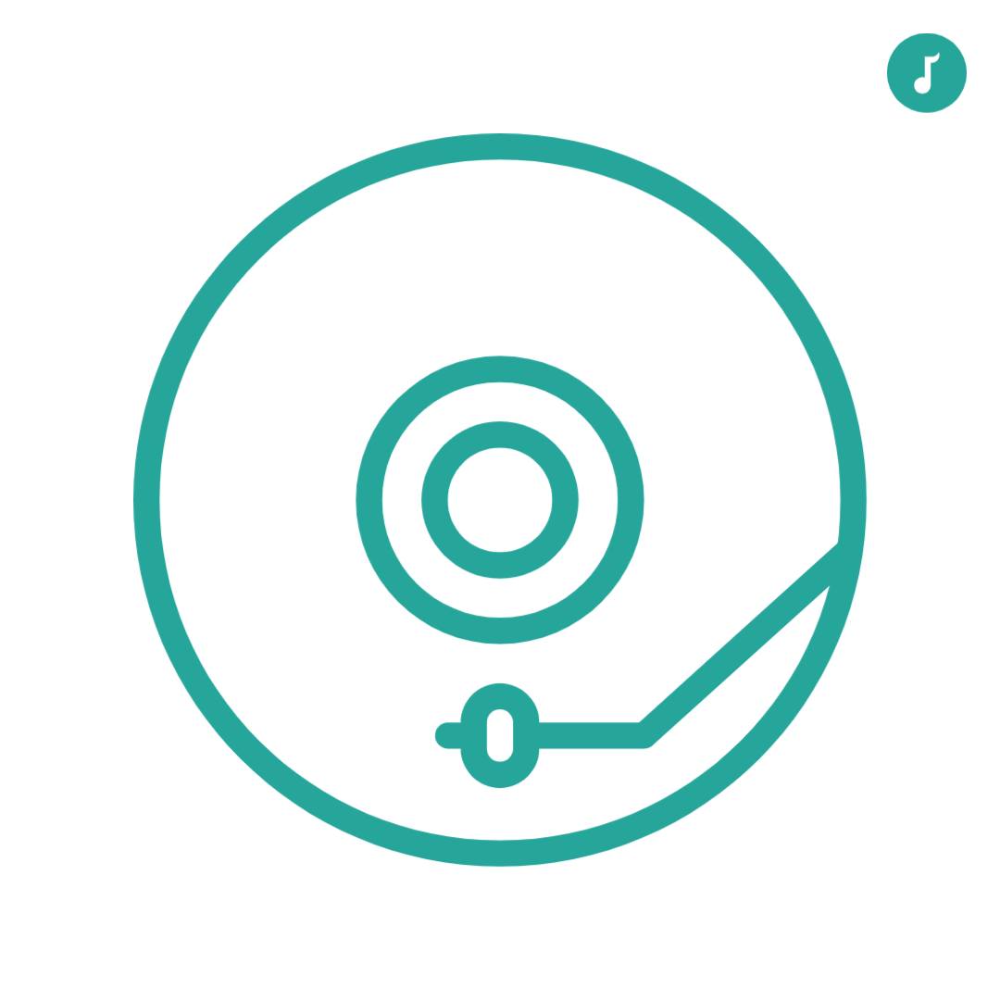

# Kenjo

(edition) to run the App & Api:

  run in Kenjo folder `$ ng serve -o` & run in Api `$ docker-compose up` 
  
  0r run in Kenjo folder `$  docker-compose build`  & `$ docker-compose up` 
  


Kenjo Challenge: dev challenge [Music Angular App] with Docker-Api.

## API Documentation

    - The backend is already developed and dockerized by Kenjo Team, in https://hub.docker.com/r/gonzalokenjo/kenjo-challenge.

## Angular Front-End

    - Starting project with routing and SaSS as preprocessor for CSS

`$ ng new Kenjo-Challente`

    - Installing Angular Material, Flex-Layout and CDK.

`$ ng add @angular/material` & `$ npm i @angular/flex-layout @angular/cdk --save`

## Design

TODO <---- (stom of ideas)

## Create Component

- Layout with module
  `$ ng g c layout` & `$ ng g m layout`
- Pages
  `$ ng g c pages/home` & `ng g m pages`

(Note: remove them from app.module always because Angular will add automatically and add to layout.module)
(Important: add layout.module to the app.module, how is now the gate for all)

- Working in the Routing-Module
  TODO <----------> add routing module to Layout

- Create a Sharing-Component with Module
  Recommended by Angular Team [https://angular.io/guide/sharing-ngmodules].
  `$ ng g c shared/header`
  `$ ng g c shared/footer`
  `$ ng g c shared/sidebar`

- Create a Albums-Components and Artists-Components
  `$ ng g c pages/artists` and add to the routing module

```javascript
{ path: 'artists', component: ArtistsComponent}
```

`$ ng g c pages/albums` and add to the routing module

```javascript
{ path: 'albums', component: AlbumsComponent}
```

`$ ng g c pages/artist` and add to the routing module

```javascript
{ path: 'artists/:artistId', component: ArtistComponent }
```

`$ ng g c pages/album` and add to the routing module

```javascript
{ path: 'albums/:albumId', component: AlbumComponent }
```

- Create the Logo for the challenge in Adobe
  The icon is a draw with form of Vinyl, I think it represents the challenge well. 

### Structure

- The Idea is create a functional App with nice view and easy to use. The App in Angular(Typescript and SaSS) will have two part (gates) in the first a presentation simple Landing Page with Materialize CSS [https://materializecss.com/about.html] I use sometimes and givin very nice views, so modern a cool. For this app I use two photos Artist in app Phone and Vinyl running.

- App will bea a Synthetic style with Flex-Layout and Angular Material [https://material.angular.io/]. I like use this because it gives so nice presentation in short time (if you know), there si some limitation but for this challenge it is perfect.

- The colors. I decide use a combination of black, dark-gray, dark-pink and blue-green.

- Time and Form Working: I concurrently working in Artist part first because I wanna present a complete app. When Artist part will be done, next Albums the core of the challenge.

- Commented: Usually this has many comments and annotation for Kenjo Team.

- Structure:
  - - App
      - Landing Page
      - Layout
        - Home
      - Modules
        - Artist Components
        - Album Components
      - Shared
        - Header, Sidebar and Footer
      - Redux (extra)
- The App will use internal Rotting and fake login with Guard.

## Routing

The app use Angular routing with routes fix and dynamic for link the different component. To render in a component a element base on the info from the MongoDB the ID is pass to the URL for this approach.

## Guard or LoginGuard

Additionally I add the guard for the internal routing ( a simulation of login ) for 20 minutes using a very nice external library call MomentJS to compare the time with register one in LocalStorage.

## Pipe

I create Pipe to check wherever the URL is images url in the app ( I know tha is possible use validation but to use different ways in the challenge ).

## Two Ideas for Many Element

One task of the challenge is to post many elements (artists o albums) in one time, all in array of object. Mast be valid element.

- First: Use Redux to handel many input.(I did not have time to work in it)
- Second: Get All Element and manege them in the from and send to DB.

### Done!

- Run the App

The app is working periodically you can run the app by Docker or NPM/ng.

- Conclusion

For time reasons, I work for another company, I have not been able to implement all the ideas that I had in mind, for example;

- Use Redux to store perfectly validated forms for group submission to the database.
- Work on a bigger and better Landing Page with a Parallax style and animations
- A Firebase Oauth validation system.
- A real-time chat
- link the artists and their videos to the Youtube API, Spotify and Albums.
- A proprietary player built in Angular entirely in Angular.

These are some achievable ideas that would give the App greater value and a great development demonstration.

- Test, for me it was essential to create some Test in Jasmin or Karma but it is a part that I need improve for the future in the FrontEnd, since I usually use Chai and Mocha in NodeJS.

I have tried to develop each of the components by Debugging in ChromeDevTool to completely clean the console of errors and bad development practices.

Thanks for sending me the Challenge. I hope to be part of your team and continue learning. Improving product development with great quality.

Kind Regard
Hamada
------
